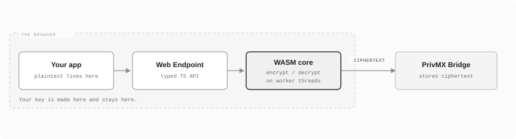
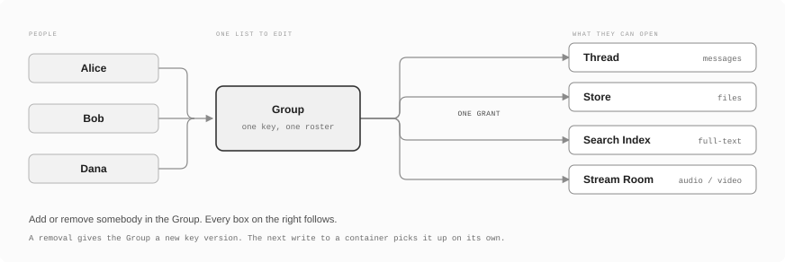
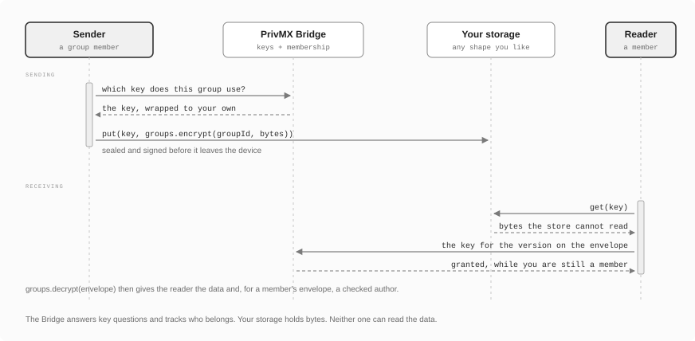
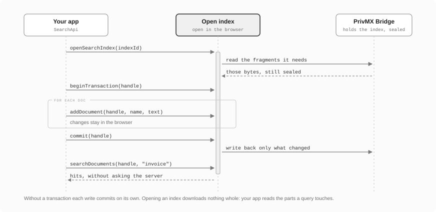

# PrivMX Web Endpoint

> End-to-end encrypted messaging, file storage, and real-time media in the
> browser, powered by a C++ cryptography core compiled to WebAssembly.

[](https://www.npmjs.com/package/@simplito/privmx-webendpoint)
[](#)
[](#packaging)
[](#license)

**[Getting Started](https://docs.privmx.dev/docs/latest/js/introduction)** ·
**[API Reference](https://docs.privmx.dev/docs/latest/reference/webendpoint/api-reference/connection)** ·
**[PrivMX Bridge docs](https://docs.privmx.dev/docs/latest/start/privmx-bridge)**

This SDK connects your browser app to a **PrivMX Bridge**. Your app encrypts and
decrypts everything on the device. The Bridge only ever holds ciphertext.

Two ideas carry the whole library:

- **A Group is who you share with.** It is a list of people with a key of its own.
  You can encrypt data for a Group directly, or give the Group access to a
  container.
- **A container is what you share.** Threads, Stores, Inboxes, KVDBs, Search
  Indexes and Stream Rooms come ready to use. Pick the one that fits your data
  and give it to a Group.

This README walks through both, in that order.

### Quick look

```ts
import { Endpoint, setupAuto } from "@simplito/privmx-webendpoint";

await setupAuto();                                   // load the WASM core
const conn   = await Endpoint.connect(privateKey, solutionId, bridgeUrl);
const groups = await conn.getGroupApi();

const groupId = await groups.createGroup(contextId, [alice, bob], [alice], publicMeta, privateMeta);

// A Group can encrypt on its own. No container needed.
const sealed = await groups.encrypt(groupId, new TextEncoder().encode("ship it"));
const opened = await groups.decrypt(sealed);         // you also learn who wrote it
```

**You need** a browser page with cross-origin isolation (see
[Before you start](#before-you-start)) and a running
[PrivMX Bridge](https://docs.privmx.dev/docs/latest/start/privmx-bridge). This
SDK runs in browsers only.

---

## Contents

- [How it works](#how-it-works)
- [Installation](#installation)
- [Before you start](#before-you-start)
- [Working with Groups](#working-with-groups)
  - [1. Make a Group](#1-make-a-group)
  - [2. Add and remove people](#2-add-and-remove-people)
  - [3. Encrypt something for a Group](#3-encrypt-something-for-a-group)
  - [4. Files of any size](#4-files-of-any-size)
  - [5. Senders with no account](#5-senders-with-no-account)
  - [6. Live notifications](#6-live-notifications)
- [What's included](#whats-included)
- [Search over encrypted data](#search-over-encrypted-data)
- [Live audio and video](#live-audio-and-video)
- [Small helpers](#small-helpers)
- [Examples](#examples)
- [Loading the WASM assets](#loading-the-wasm-assets)
- [Common tasks](#common-tasks)
- [Receiving events](#receiving-events)
- [Error handling](#error-handling)
- [Logging](#logging)
- [Lifecycle](#lifecycle)
- [Production checklist](#production-checklist)
- [Packaging](#packaging)
- [Building from source](#building-from-source)
- [Testing](#testing)
- [License](#license)

---

## How it works



Your app encrypts data before it touches the network. Your private key signs you
in and opens your data on the device, and it stays there. The Bridge sees
ciphertext and nothing else.

Start with **`Endpoint`** (`setup` or `setupAuto`, then `connect` or
`connectPublic`). Take the APIs you need off the connection:
`getGroupApi()`, `getThreadApi()`, `getStoreApi()`, `getInboxApi()`,
`getKvdbApi()`, `getSearchApi()`, `getStreamApi()`, `getEventManager()`.

Two words you will meet right away:

- **Solution / Context.** Scopes you create in the Bridge admin panel. A Context
  is the workspace holding your users, Groups and containers.
- **`publicMeta` and `privateMeta`.** Most objects carry two metadata blobs. The
  server can read `publicMeta`, so keep secrets out of it. Your app encrypts
  `privateMeta`, and payloads are always encrypted. Both are raw `Uint8Array`,
  and the usual thing to put in them is a JSON string, so the SDK ships
  `serializeObject` / `deserializeObject` for exactly that (see
  [Small helpers](#small-helpers)).

### Listing, paging and filtering

Every `list*` call takes the same `PagingQuery`: `skip`, `limit` (100 max),
`sortOrder`, and optionally `sortBy`, `lastId` and `queryAsJson`. Prefer `lastId`
over `skip` on long lists, because it does not shift when somebody writes while
you page.

`queryAsJson` filters **on `publicMeta` only** - it is the one part of an object
the server can read, so it is the one part it can filter on. Decide what belongs
there when you design the object, not when you need the query:

```ts
const page = await threads.listMessages(threadId, {
    skip: 0, limit: 50, sortOrder: "desc",
    queryAsJson: JSON.stringify({
        kind: "invoice",                        // a field of your publicMeta
        "meta.amount": { $gt: 1000 },           // dot notation for nested fields
        "#creator": "alice",                    // built-in fields take a #
    }),
});
```

`$gt`/`$gte`/`$lt`/`$lte`/`$eq`/`$ne`, `$in`/`$nin`, `$startsWith`/`$endsWith`/
`$contains` and `$and`/`$or`/`$nor` are available. The full list, the built-in
`#` fields and the cursor rules are in
[Queries and pagination](https://docs.privmx.dev/docs/latest/start/pagination).

---

## Installation

```bash
npm install @simplito/privmx-webendpoint
```

You also need a running **PrivMX Bridge**. The quickest way to get one is the
Dockerised CLI, which pulls the images and generates the keys and a Context for
you:

```bash
git clone https://github.com/simplito/privmx-bridge-docker
cd privmx-bridge-docker
./setup.sh
```

It prints a Bridge URL, a Solution ID, a Context ID, and a **management API key**
(`apiKeyId` and `apiKeySecret`) that stays on **your** server. The full
walkthrough, including the Streams module and a non-Docker install, is in
[Bridge installation](https://docs.privmx.dev/docs/latest/start/installation);
[What is PrivMX Bridge](https://docs.privmx.dev/docs/latest/start/privmx-bridge)
explains what it does.

---

## Before you start

Three things have to be in place.

**1. Cross-origin isolation.** The core uses `SharedArrayBuffer`, which browsers
only allow on an isolated page. Serve these two headers:

```
Cross-Origin-Opener-Policy: same-origin
Cross-Origin-Embedder-Policy: require-corp
```

In Vite that takes a five-line dev-server plugin. See
[`example/vite/vite.config.ts`](example/vite/vite.config.ts), and serve the same
headers in production.

**2. The WASM core.** `setupAuto()` finds the assets inside the installed
package, so you copy nothing into `public/`:

```ts
import { setupAuto } from "@simplito/privmx-webendpoint";
await setupAuto();                       // once, before anything else
```

If your bundler cannot resolve package assets, copy them yourself and call
`Endpoint.setup({ assetsBasePath: "/privmx" })`. See
[Loading the WASM assets](#loading-the-wasm-assets).

**3. A key, and a server that vouches for it.** Your app makes the private key
in the browser and keeps it there. Send the **public** key to your backend, which
registers it in the Context with the management API key:

```ts
import { Endpoint } from "@simplito/privmx-webendpoint";

const crypto     = await Endpoint.createCryptoApi();
const privateKey = await crypto.generatePrivateKey();       // keep it in the keychain
const pubKey     = await crypto.derivePublicKey(privateKey);

await fetch("/api/register-user", {                          // YOUR backend
    method: "POST",
    body: JSON.stringify({ userId, pubKey }),
});

const connection = await Endpoint.connect(privateKey, solutionId, bridgeUrl);
```

> That API key can administer your whole Solution, so keep it off the browser.
> [`example/vite/src/server.ts`](example/vite/src/server.ts) shows the two Bridge
> calls a backend makes: `manager/auth` and `context/addUserToContext`. It runs
> inside the page so the examples need no server process, and it says so at the
> top of the file.

The rest of this README assumes `connection` is that client and `me` is
`{ userId, pubKey }`.

---

## Working with Groups

A **Group** is a list of people in a Context, with a key of its own. It does two
jobs. You give it access to containers, and you encrypt data for it directly.



Read this section even if you already know which container you want.
Everything in the next one takes a Group.

### 1. Make a Group

```ts
const groups = await connection.getGroupApi();

const groupId = await groups.createGroup(
    contextId,
    [alice, bob],                                        // members  (UserWithPubKey[])
    [alice],                                             // managers (can change the roster)
    new TextEncoder().encode(JSON.stringify({ name: "Design" })),   // publicMeta, readable
    new Uint8Array(),                                    // privateMeta, encrypted
);

const group = await groups.getGroup(groupId);
console.log(group.keyVersion, group.users);              // 1, ["alice", "bob"]
```

`getGroup` also gives you `groupPubKey`, the Group's public key. You need it to
grant the Group to a container, and to let outsiders encrypt for it.

`listGroups(contextId, pagingQuery)` lists them. A listing page carries no
metadata, because your app decrypted nothing to build it, so read your tag from
`getGroup`.

### 2. Add and remove people

Adding somebody costs nothing elsewhere. The key version stays put, no container
re-keys, and the newcomer reads what the Group wrote before they joined.

```ts
await groups.addGroupMembers(groupId, [
    { user: { userId: "dana", pubKey: danaPubKey }, role: "user" },
    { user: { userId: "erin", pubKey: erinPubKey }, role: "manager" },
]);
```

Removing somebody moves the Group to a new key version. That is what locks the
leaver out:

```ts
await groups.removeGroupMembers(groupId, ["bob", "carol"]);   // one bump for both
```

The key version moves once per call, not once per person, so remove everybody in
one call. Three things follow from a removal:

- **The Group's public key changes.** `removeGroupMembers` is the only call that
  does this, so read `groupPubKey` again with `getGroup` (or let `grantFor` do
  it) before you hand out a new grant or link.
- **Containers repair themselves.** They list the Group in `staleGroups` until
  the next write re-keys them. Nothing to re-key by hand.
- **Open sessions are not cut off.** A member who is still connected keeps
  reading with the key their session already holds, a fresh session does not.
  Close the session too if you need the live case shut.

Removal cost grows with the *logarithm* of the Group size, so Groups of a few
thousand people are fine. For which key versions stay readable and for whom, see
the [API reference](https://docs.privmx.dev/docs/latest/reference/webendpoint/api-reference/connection).

### 3. Encrypt something for a Group

You do not need a container. `encrypt` seals the bytes for the Group and signs
them with your key:

```ts
const sealed = await groups.encrypt(groupId, new TextEncoder().encode("ship it"));
await myBucket.put(key, sealed);                    // your storage sees ciphertext
```

`decrypt` gives you the plaintext back together with the envelope's metadata,
including who sealed it:

```ts
import { Types } from "@simplito/privmx-webendpoint";

const opened = await groups.decrypt(await myBucket.get(key));
if (opened.type === Types.EnvelopeType.ENVELOPE_FROM_MEMBER) {
    console.log("written by", opened.authorPubKey);   // checked
} else {
    console.log("anonymous, and nobody can tell you who sent it");
}
```

Check `type`. A filled-in author field proves nothing on its own.

An envelope carries its own Group id and key version, so any member can open it
later, even after the key rotates, with nothing else alongside it.



The Bridge works as a key server here. It tracks who belongs to the Group and
hands out the group key, and every copy it holds is wrapped to a member's public
key, so the Bridge cannot open one either. Your app unwraps its own copy on the
device.

After that you decide where the sealed bytes live: a Postgres column, an S3
bucket, a file the user downloads. Whoever stores them learns nothing from them.

### 4. Files of any size

`sealFile` gives you a `TransformStream`. Plaintext goes in, ciphertext comes
out, and the envelope arrives at the end.

```ts
const sealer = groups.sealFile({ groupId, size: file.size });

await file.stream().pipeThrough(sealer).pipeTo(myBucket.writable(key));
await myBucket.put(`${key}.envelope`, await sealer.envelope);
```

Keep both. The ciphertext is the file. The envelope is a small header naming the
Group, the key version, the author and the size, and without it nobody opens the
file, including members.

Reading it back mirrors that:

```ts
const reader = await groups.openFile(envelope);
const blob   = await new Response(ciphertext.pipeThrough(reader.stream)).blob();

if (!(await reader.info).complete) throw new Error("the file was cut short");
```

Only a start-to-end read can answer `info.complete`. For a **range**, ask where
to start and fetch that part:

```ts
const r = await groups.openFile(envelope, { from: 1 << 20, length: 64 });
const head = await new Response(
    myBucket.readableFrom(key, r.ciphertextOffset).pipeThrough(r.stream),
).text();                                          // output starts at plaintext byte 1 MiB
```

`ciphertextOffset` is the point. In a 2 MiB file, seeking to 1 MiB leaves about
half the ciphertext unfetched. A seeked read gives up the completeness check, so
`complete` comes back `false` there.

Streams bring backpressure with them, so a slow sink slows the reader down and a
file bigger than memory still goes through. Add progress and cancellation with
pieces the pipeline already speaks:

```ts
import { progressStream } from "@simplito/privmx-webendpoint";

await file.stream()
    .pipeThrough(progressStream((sent) => setPct(sent / file.size)))
    .pipeThrough(groups.sealFile({ groupId, size: file.size }))
    .pipeTo(myBucket.writable(key), { signal });
```

The chunked calls underneath (`beginFileEncryption`, `encryptFileChunk`,
`finishFileEncryption`) are still there if you want to drive them.

### 5. Senders with no account

Someone outside your Context can encrypt something only the Group can open. A
tipster, a customer with a link, a form on a public page. They need the Group's
**id and public key**, both public:

```ts
import { Endpoint } from "@simplito/privmx-webendpoint";

// No user, no registered key, no login.
const guest       = await Endpoint.connectPublic(solutionId, bridgeUrl);
const guestGroups = await Endpoint.createGroupApi(guest);

const sealed = await guestGroups.encryptAnonymously(
    groupId, groupPubKey, new TextEncoder().encode("I saw the invoices being rewritten"),
);

// Files have their own call, which says what it does.
const sealer = guestGroups.sealFileAnonymously({ groupId, groupPubKey, size: file.size });
await file.stream().pipeThrough(sealer).pipeTo(myBucket.writable(key));
```

Three properties come with it:

- **Sealing calls no server.** The Bridge never learns the submission happened.
- **Nobody can attribute it.** Each call uses a throwaway keypair, so members see
  `ENVELOPE_ANONYMOUS` and no author.
- **The sender cannot read it back.** Only the Group can.

A guest cannot send Group notifications, which need membership. Whatever
transport carried the ciphertext carries the "something arrived" signal too.

The key in a link ages. Every removal mints a new one, and a sender holding the
old key still gets through, so a published link does not break. Hand out a fresh
one when you can: it is the key the Group is on now.

[`example/secure-intake`](example/secure-intake) is a working version of this,
built on GroupApi alone.

### 6. Live notifications

`sendCustomEvent` pushes a small sealed payload to every member of the Group in
one request:

```ts
import { serializeObject } from "@simplito/privmx-webendpoint";

await groups.sendCustomEvent(groupId, "presence", serializeObject({ typing: true }));
```

Receiving, once per connection:

```ts
import {
    Types,
    createGroupCustomEventSubscription,
    deserializeObject,
} from "@simplito/privmx-webendpoint";

const events = await connection.getEventManager();
await events.subscribe([
    createGroupCustomEventSubscription({
        channel: "presence",
        selector: Types.GroupEventSelectorType.GROUP_ID,
        id: groupId,
        callbacks: [(e) => {
            if (e.data.statusCode !== 0) return;              // could not be opened
            showTyping(e.data.authorPubKey, deserializeObject(e.data.payload));
        }],
    }),
]);
```

Payloads cap out around 11 KB, and anyone offline misses the event. Put anything
that has to survive in a container.

---

## What's included

With a Group in hand, choose a container by the shape of your data. The Group
already answers who may read it.

| You need | Use | Create with |
| --- | --- | --- |
| A conversation or a feed | **Thread** | `createThread(…, groups)` |
| Files, chunked, any size | **Store** | `createStore(…, groups)` |
| Records under keys | **KVDB** | `createKvdb(…, groups)` |
| Submissions from outside the Context | **Inbox** | `createInbox(…, groups)` |
| Full-text search over encrypted documents | **Search Index** | `createSearchIndex(…, groups)` |
| Live audio and video | **Stream Room** | `createStreamRoom(…, groups)` |

### Giving a Group access

Every container takes the same optional last argument: a list of
`GroupGrantWithKey`, which pairs the Group id with the key you verified it at.

```ts
import { strToUint8 } from "@simplito/privmx-webendpoint";

const threads = await connection.getThreadApi();
const group   = await groups.getGroup(groupId);

const grant = {
    groupId,
    role: "user",                                    // or "manager" of this container
    groupPubKey: group.groupPubKey,
    groupEpoch: group.keyVersion,
};

const threadId = await threads.createThread(
    contextId, [alice], [alice], publicMeta, privateMeta, undefined, [grant],
);

await threads.sendMessage(threadId, new Uint8Array(), new Uint8Array(), strToUint8("Hello"));
```

The container keeps its own `users` and `managers` lists. Use those for one-off
guests and let the Group carry everyone else.

### Files in a Store

`uploadFile` is the whole upload. One call, streamed, with progress and
cancellation.

```ts
const store  = await connection.getStoreApi();
const fileId = await store.uploadFile({
    storeId, file,                                   // a File, a Blob, anything with size + stream()
    onProgress: (sent) => setPct(sent / file.size),
    signal,                                          // cancelling deletes the partial upload
});

await store.saveFileToDisk(fileId);                  // streams to disk where the browser allows it
```

To read, call `store.fileReadable(fileId, { from, length })` and you get an
ordinary `ReadableStream`. Hand it to `new Response(...)`, pipe it somewhere, or
take a self-closing handle with `store.openFileHandle(fileId)` when you want to
seek by hand. `InboxApi` has the same two read methods for attachments.

---

## Search over encrypted data

A server holding ciphertext cannot run your query. A **Search Index** solves that
by keeping the index where the plaintext already is. The Bridge stores the index
encrypted. Your app opens it in the browser and changes it as documents come and
go.

Opening an index downloads nothing. The engine reads the fragments a query
touches, at byte offsets, and writes back the parts it changed, so an index far
larger than memory still works.



An Index is a container like the others. Same `users` and `managers`, same
`groups` grant, same `staleGroups`, and the same automatic re-key on the next
write after somebody leaves a Group.

### Indexing and searching

```ts
import { Types } from "@simplito/privmx-webendpoint";

const search = await connection.getSearchApi();

const indexId = await search.createSearchIndex(
  contextId, [me], [me], publicMeta, privateMeta,
  Types.IndexMode.WITH_CONTENT,                   // keep the text, so hits can show it
  undefined,                                      // policies
  [grant],                                        // the Group that may search it
);

const handle = await search.openSearchIndex(indexId);

await search.addDocument(handle, messageId, "the invoice was rewritten");
const hits = await search.searchDocuments(handle, "invoice", { skip: 0, limit: 20, sortOrder: "desc" });
//    hits.readItems[].name  ->  what you indexed it under, e.g. a message id

await search.closeSearchIndex(handle);
```

`IndexMode.WITH_CONTENT` keeps the text in the index, so results can carry it.
`WITHOUT_CONTENT` keeps only what a query needs to match, which suits you when
the content lives in a Thread or a Store and `name` points at it.

### Batch your writes

Each commit writes the changed fragments and syncs them, so a commit per document
costs a round of network writes per document:

```ts
await search.beginTransaction(handle);
for (const m of batch) await search.addDocument(handle, m.id, m.text);
await search.commit(handle);                       // one upload for the batch
```

`rollback(handle)` throws the batch away. In a chat, open a transaction on the
first message and commit a second or two after the last one. Other members find a
document once the commit lands.

### Two rules before you build on it

- **One open handle per index.** Two open handles on the same index leave it
  empty for whoever holds the older one. Close the previous
  handle before opening another, the way `example/group-chat` does when a member
  re-enters the room.
- **The index is its own thing.** Deleting a message from a Thread leaves it
  findable until you call `deleteDocument` too.

[`example/group-chat`](example/group-chat) is a chat with one Group given to both
a Thread and an Index, including the batching above.

---

## Live audio and video

A **Stream Room** carries WebRTC audio and video between its members. Every
media frame is encrypted with AES-256-GCM in a Web Worker before it reaches the
network, so the media server routes frames it cannot play.

Create one the way you create any container, with the same `groups` grant:

```ts
const streams = await connection.getStreamApi();

const roomId = await streams.createStreamRoom(
    contextId, [me], [me], publicMeta, privateMeta,
    undefined,                                       // policies
    undefined,                                       // emptyRoomTtl
    [grant],
);
```

**To publish.** Join, make a stream, stage the tracks you want, then publish:

```ts
await streams.joinStreamRoom(roomId);

const handle = await streams.createStream(roomId);
const media  = await navigator.mediaDevices.getUserMedia({ audio: true, video: true });
for (const track of media.getTracks()) {
    await streams.addStreamTrack(handle, { track });
}

await streams.publishStream(handle, (state) => console.log("peer connection", state));
```

Stage more track changes later and apply them with `updateStream(handle)`. Stop
with `unpublishStream(handle)`, and leave with `leaveStreamRoom(roomId)`.

**To receive.** Register a listener, ask the room what is on offer, then
subscribe to the streams you want:

```ts
streams.addRemoteStreamListener({
    streamRoomId: roomId,
    onRemoteStreamTrack: (event) => attachToVideoElement(event.track),   // RTCTrackEvent
    onRemoteData: (bytes, statusCode) => {
        if (statusCode === 0) handleDataChannelBytes(bytes);
    },
});

const available  = await streams.listStreams(roomId);                    // StreamInfo[]
const subscriber = await streams.createSubscriberStream(
    roomId,
    available.map((s) => ({ streamId: s.id })),                          // whole streams
);
```

To take single tracks instead of whole streams, add `streamTrackId` to a
subscription. Adjust the set later with `updateSubscriberStream`, and tear it
down with `removeSubscriberStream(subscriber)`.

**Two more things you may want.** `addStreamTrack(handle, { createDataChannel: true })`
gives you a track id for `sendData(trackId, bytes)`, which sends encrypted bytes
over a data channel. And `readAudioStats()` returns the current audio levels for
local and remote tracks in one call, with no timer of its own, so poll it on
whatever interval your UI needs.

---

## Small helpers

Four things come up in every project, so the SDK ships them. Import from the
package root.

**Turn a Group into a grant.** Every `create*` and `update*` call wants the same
four fields copied off a Group:

```ts
import { groupGrant } from "@simplito/privmx-webendpoint";

const readGrant = await groups.grantFor(groupId);        // reads the Group for you
const heldGrant = groupGrant(group, "manager");          // when you already hold it
```

`grantFor` defaults to the `"user"` role and takes `"manager"` as a second
argument.

**Turn ids into users with keys.** `Thread.users` and its siblings hold ids,
while `update*` and `rotate*Keys` want public keys:

```ts
const users = await connection.resolveUsers(contextId, thread.users);
```

It pages through the Context for you and keeps your order. An id the Context
does not know throws, because a quietly shorter roster would drop somebody.

**Move between bytes and text or JSON.** Payloads and metadata are
`Uint8Array`:

```ts
import { strToUint8, uint8ToStr, serializeObject, deserializeObject } from "@simplito/privmx-webendpoint";

await threads.sendMessage(threadId, new Uint8Array(), serializeObject({ kind: "note" }), strToUint8("hi"));

const message = await threads.getMessage(messageId);
uint8ToStr(message.data);                                // "hi"
deserializeObject(message.privateMeta);                  // { kind: "note" }
```

**Put a stream pipeline together.** `progressStream(onBytes)` counts bytes as
they pass, and `takeStream(n)` cuts a stream off after `n` bytes. Both fit
anywhere in a `pipeThrough` chain. See [Files of any size](#4-files-of-any-size).

---

## Examples

Three runnable apps live in [`example/`](example). Each one starts a local
Bridge with `scripts/example_bridge`, installs the SDK from a local build, and
runs on `npm run dev`.

| Example | What it is |
| --- | --- |
| [`example/vite`](example/vite) | The smallest complete app. Connect, make a Thread, send a message. |
| [`example/group-chat`](example/group-chat) | A chat for two, with one Group given to a Thread and a Search Index, and membership changes you can watch. |
| [`example/secure-intake`](example/secure-intake) | Anonymous submissions to a team, on GroupApi alone. Sealed files, ranged reads, and a store that reads nothing. |

---

## Loading the WASM assets

The assets are exported at `@simplito/privmx-webendpoint/assets/*`. Pick the
strategy that fits your setup:

**A. Zero-config (recommended, any bundler)** - Vite / webpack 5 / Rollup / Parcel / Next:

```ts
import { setupAuto } from "@simplito/privmx-webendpoint";
await setupAuto();                       // resolves assets via import.meta.url
```

`setupAuto()` is ESM-only (it relies on `import.meta.url`).

> **Vite users:** exclude the SDK from pre-bundling so `import.meta.url` resolves
> the assets against the real package location:
> ```ts
> optimizeDeps: { exclude: ["@simplito/privmx-webendpoint"] }
> ```
> See [`example/vite/vite.config.ts`](example/vite/vite.config.ts) for the full setup.

**B. Per-asset URLs** - when you want explicit control (any unset URL falls back to
`assetsBasePath`):

```ts
import { Endpoint } from "@simplito/privmx-webendpoint";
await Endpoint.setup({
  wasmModuleUrl: new URL("@simplito/privmx-webendpoint/assets/endpoint-wasm-module.js",   import.meta.url).href,
  wasmUrl:       new URL("@simplito/privmx-webendpoint/assets/endpoint-wasm-module.wasm", import.meta.url).href,
  workerUrl:     new URL("@simplito/privmx-webendpoint/assets/privmx-worker.js",          import.meta.url).href,
});
```

`wasmUrl` is wired into the Emscripten `locateFile`, so the `.wasm` can live anywhere.

**C. Copy to a served directory** - no bundler, or you prefer static hosting:

```bash
cp node_modules/@simplito/privmx-webendpoint/assets/* ./public/privmx-assets/
```
```ts
import { Endpoint } from "@simplito/privmx-webendpoint";

await Endpoint.setup({ assetsBasePath: "/privmx-assets" });
```

| Asset | Purpose |
| --- | --- |
| `endpoint-wasm-module.js` | Emscripten glue (injected by `setup()`) |
| `endpoint-wasm-module.wasm` | The C++ core (~6.7 MB; serve gzip/brotli) |
| `privmx-worker.js` | E2EE web worker (streaming) |
| `rms-processor.js` | Audio worklet behind `readAudioStats()` |

Framework copy snippets (for strategy C): **Vite** -
[`vite-plugin-static-copy`](https://www.npmjs.com/package/vite-plugin-static-copy);
**Next.js** - copy into `public/` in a `postinstall`, call `setup()` client-side only;
**webpack** - `CopyWebpackPlugin`.

---

## Common tasks

Files and Groups have their own sections above:
[Files of any size](#4-files-of-any-size) and
[Files in a Store](#files-in-a-store). What is left:

**Take submissions from outside (Inbox).** Works on a guest connection from
`connectPublic`: `createFileHandle` per attachment, then `prepareEntry`,
`writeToFile`, `sendEntry`. To take a submission the Bridge never records at
all, see [senders with no account](#5-senders-with-no-account).

**Older file helpers.** `FileUploader`, `StreamReader` and `downloadFile` in
`@simplito/privmx-webendpoint/extra` still work the way they always did. In new
code use the methods on `StoreApi`, `InboxApi` and `GroupApi`. Those stream,
take an `AbortSignal`, and close their own handles.

See the [API reference](https://docs.privmx.dev/docs/latest/reference/webendpoint/api-reference/connection)
for the full surface; every method carries inline docs (hover in your IDE).

---

## Receiving events

Build a subscription query, subscribe, then drive the global queue:

```ts
import { Endpoint, Types } from "@simplito/privmx-webendpoint";

const query = await threadApi.buildSubscriptionQuery(
  Types.ThreadEventType.MESSAGE_CREATE,
  Types.ThreadEventSelectorType.THREAD_ID,
  threadId,
);
await threadApi.subscribeFor([query]);

const queue = await Endpoint.getEventQueue();
for await (const event of queue) {         // ends when queue.emitBreakEvent() fires
  console.log(event.channel, event.type, event.data);
}
```

(`queue.waitEvent()` is still there if you'd rather drive the loop yourself.)

For a higher-level option, every connection exposes a **single event manager**
(`connection.getEventManager()`) that runs the loop and dispatches to **typed**
callbacks for you. Subscribe to events from any container: Threads, Stores, Inboxes,
KVDBs, custom events, user/Context membership and connection-state - through the
one `subscribe()` call, mixing containers freely:

```ts
import {
  Types,
  createThreadSubscription,
  createStoreSubscription,
} from "@simplito/privmx-webendpoint";

const events = await connection.getEventManager();

const ids = await events.subscribe([
  createThreadSubscription({
    type: Types.ThreadEventType.MESSAGE_CREATE,
    selector: Types.ThreadEventSelectorType.THREAD_ID,
    id: threadId,
    callbacks: [(e) => console.log(e.data)], // e.data is typed as Types.Message
  }),
  createStoreSubscription({
    type: Types.StoreEventType.FILE_CREATE,
    selector: Types.StoreEventSelectorType.STORE_ID,
    id: storeId,
    callbacks: [(e) => console.log(e.data)], // e.data is typed as Types.File
  }),
]);

// later
await events.unsubscribe(ids);
```

Build each entry with the typed `create*Subscription` helper for the container you
want (`createThreadSubscription`, `createStoreSubscription`,
`createInboxSubscription`, `createKvdbSubscription`, `createGroupSubscription`,
`createGroupCustomEventSubscription`, `createEventSubscription`,
`createUserEventSubscription`, `createConnectionSubscription`). `PrivmxClient`
exposes the same single `getEventManager()` - see the [example](example/vite) and
the API reference.

---

## Error handling

API methods reject with **`NativeError`** for server/crypto failures. Branch on the
exported error-code constants instead of matching message strings:

```ts
import { NativeError, StoreErrorCode } from "@simplito/privmx-webendpoint";

try {
  await storeApi.closeFile(handle);
} catch (e) {
  if (e instanceof NativeError && e.code === StoreErrorCode.FILE_VERSION_MISMATCH) {
    // someone updated the file concurrently - re-open and retry
  }
}
```

`NativeError` carries `code` (number), `scope` (`"Core"`, `"Store"`, …) and
`fullMessage`. Code constants are exported per scope: `CoreErrorCode`,
`ConnectionErrorCode`, `ThreadErrorCode`, `StoreErrorCode`, `InboxErrorCode`,
`KvdbErrorCode`, `LockErrorCode`, `SearchErrorCode`, `GroupErrorCode`, 
`EventErrorCode`, `StreamRoomErrorCode`.

---

## Logging

The library is **silent by default**. Opt into diagnostics (or pipe logs to your own
sink) with `setEndpointLogger`:

```ts
import { setEndpointLogger } from "@simplito/privmx-webendpoint";

setEndpointLogger({ level: "warn" });                 // "silent" | "error" | "warn" | "info" | "debug"
setEndpointLogger({ sink: (lvl, label, args) => myLogger.log(label, ...args) });
```

---

## Lifecycle

```
setup()  -->  connect() / connectPublic()  -->  connection.getXApi()  -->  …work…  -->  connection.disconnect()
 (once)        (per session)                   (cached per connection)            (frees all APIs + WASM objects)
```

`disconnect()` invalidates every API created from that connection (including stream
sessions and the E2EE worker) - no manual per-API cleanup is needed. Calling a method
on an API after disconnect throws.

---

## Production checklist

- **Cross-origin isolation:** serve `Cross-Origin-Opener-Policy: same-origin` and
  `Cross-Origin-Embedder-Policy: require-corp` (see the Vite guide above).
- **Worker threads:** `setup({ workerCount })` sets the async-engine pool (default 4,
  min 2); raise it for heavy parallel file transfers.
- **Memory:** the WASM heap is fixed at 260 MB - stream large files in chunks rather
  than buffering whole files in memory on top of it.
- **Compression:** the `.wasm` is ~6.7 MB; serve it gzip/brotli (brotli ≈ −70%).
- **Errors:** treat `NativeError` as your typed failure channel (see above).

---

## Packaging

The package is **ESM-only** (`"type": "module"`) - tree-shakeable, with `.js`
extensions on all internal imports so it resolves under native Node and every
bundler, and `import.meta.url`-based asset loading via `setupAuto()`. Use it
from a bundler (Vite, webpack 5, Rollup, Next, …) or native ESM; there is no
CommonJS `require` build. For `<script>`-tag / non-bundler usage, a standalone
browser bundle is available at `dist/bundle/privmx-endpoint-web.js`.

> **Subresource Integrity (CDN users):** the `.wasm` is pinned by `build-manifest.sh`.
> If you serve it from a CDN, generate an SRI hash
> (`openssl dgst -sha384 -binary endpoint-wasm-module.wasm | openssl base64 -A`) and
> use a long-lived immutable cache header.

---

## Building from source

Only needed if you change the C++ core; most contributors only touch TypeScript.

**Prerequisites:** Node.js 20+, Emscripten (the pipeline sources `emsdk` 4.0.19 from
the repo root), CMake, and Clang-format v18 for the C++ lint.

| Command | Description |
| --- | --- |
| `npm run build` | Full release build: clean -> WASM -> compile TS (ESM) -> bundle (Vite) |
| `npm run build:debug` | Full debug build (see below) |
| `npm run build:wasm` | Compile C++ -> WebAssembly (release flags) |
| `npm run build:js` | Compile TypeScript + bundle assets (no WASM recompile) |
| `npm run compile` | Emit the ESM `dist/` output (tsc + `.js`-extension fixup) |
| `npm run watch:types` | Watch TypeScript |

**Release vs debug** - release is `-O3 -flto`, `ASSERTIONS=0`, `SAFE_HEAP=0`. A debug
build (`npm run build:debug` or `PRIVMX_BUILD_TYPE=debug npm run build:wasm`) swaps in
`-O0 -g -gsource-map` (C++ source-mapped in DevTools), `ASSERTIONS=2`, `SAFE_HEAP=1`,
`STACK_OVERFLOW_CHECK=2`, and `-DDEBUG`. Debug builds are larger and slower - local use only.

---

## Testing

**Unit (Vitest):**

```bash
npm test                # vitest run
```

**End-to-end (Playwright + Docker).** `tests/compose.yaml` brings up Janus,
Coturn and MongoDB. The test fixture starts a Bridge container per worker.

```bash
cd tests && docker compose up -d && cd ..   # media servers and the database
npm run test:e2e                            # Chromium
npm run test:e2e:manybrowsers               # all browsers
```

**Lint & format** (oxlint + oxfmt; clang-format for C++):

```bash
npm run lint            # TypeScript
npm run docs:check      # every public symbol documented, every link resolves
npm run lint:clang-format
npm run format          # auto-format TS
```

---

## License

Licensed under the **PrivMX Free License**. Copyright © Simplito. All rights reserved.
